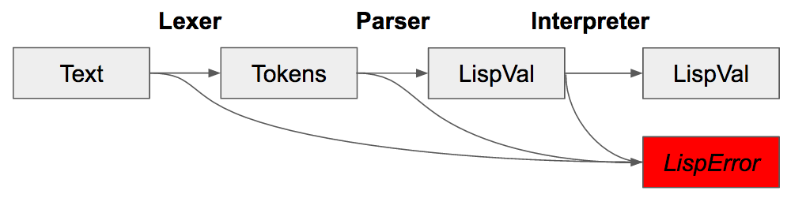

Introduction: The Bolts and Nuts of Scheme Interpreters in Haskell
------------
> The most important thing in the programming language is the name. A language will not succeed without a good name. I have recently invented a very good name and now I am looking for a suitable language. **Donald Knuth**    
## 1.0 What are we going to do?
We are going to make a very basic, but robust, programming language both simple to use and highly extendible. You are encouraged to take the language we build and add more functionality. For instance, you could use this language for running jobs on a High Performance Computing Cluster, or analyzing financial data. Language development is really a "killer app" for Haskell, and the approach we take in this tutorial is the basis you'll need to create a domain specific language for industrial purposes.    

## 1.1 Scheme Syntax
Lisp is a list processing language, and is old enough to join the AARP with a very storied history.  Scheme is an fully specified Lisp implementation, although we will be taking many liberties for the sake of simplicity.  For Scheme, this means every expression is a list. This parenthesized list has a prefix operator and is known as an S-Expression. Whenever a S-Expression is encountered, it is evaluated in the same way, minus a handful of special forms. Data is also represented as an S-Expression, and there is no syntactical difference between code and data. Scheme is well known for this minimalism.

## Scheme semantics
Similar to Haskell, Scheme is a functional programming language. Everything in our Scheme in an object, for instance numbers, strings, functions, variables, and booleans. This is our Haskell type, `LispVal`. These objects are stored in a single environment, `EnvCtx` which is queried to resolve the value of an evaluated variable. In Scheme, no object is ever destroyed, however, the scope of a variable is limited to its lexical context. Further, arguments in scheme are passed by value, so when a function is called, all of its arguments are evaluated before being passed into the function. Contrast this to Haskell, where evaluation is lazy, and values are not computed until they are needed, which is sometimes never. The environment to find and store variables is the same environment is used to find primitive functions, so when `(file? "tmp")` is evaluated, `file?` is a variable with a corresponding value (a function) in the environment.

## Scheme Type System   
Scheme is a dynamic language, like Python, Ruby, Perl, or [as compared to a static language](https://pythonconquerstheuniverse.wordpress.com/2009/10/03/static-vs-dynamic-typing-of-programming-languages/). Dynamic languages are simpler to implement, but allow for some preventable errors that would be impossible in a static language. For an example from our Scheme, `(+ 'a' 1)` is valid syntax widely open to interpretation at runtime. (Try it on the REPL!) If you are interested in building a typed language in Haskell, [this](http://okmij.org/ftp/Haskell/AlgorithmsH.html#teval) guide shows how type inference makes language engineering significantly more complex.  Dynamic languages are not all doom and gloom, they give the user tremendous flexibility. A concept called Dynamic Dispatch allows functions to be determined, at runtime, by the types of the arguments passed in, so `(+ 1 1)` and `(+ "a" "b")` could use different versions of the `+` function. 

## Interpreted

We are building an interpreted language, an alternative to compiling down to assembly language, LLVM or using a virtual machine like Java's JVM. Most generally this means that we have a program that actively runs to evaluate a program in our Scheme. This approach yields slower performance due to the higher memory and processor overhead, but we will be able to finish in the project in a single weekend. For the motivated, Lisp In Small Pieces walks you through over 30 interpreted and  2 compiled versions of Scheme, written in Scheme. You can find the program code [here](https://pages.lip6.fr/Christian.Queinnec/WWW/LiSP.html). If you want to write a language with performance in mind, you'll want to use an [LLVM backend](http://stephendiehl.com/llvm).  I warn you, there be dragons!    

#### On Type System Complexity, Cautionary Tail
Type systems are extremely complex to build, and balancing programming productivity versus performance gains is a difficult balance. For instance, Guy Steele has worked on successful languages like Common Lisp and Java, but spent most of the 8 years building Fortress getting the type system right.  Steele cited issues with the complexity of the type system when winding down development on Fortress. Although type systems are complex, its theoretical possible to create a type system so advanced that programs can have provable properties and abstractions as powerful as those in mathematics. This is far beyond the scope of this tutorial, and the majority of production code written is done in a dynamic language. However, If your are a novice, then this tutorial is a great way to get involved in a very exciting movement that will shape the way of things to come for industry programming.  For now, the best we get is an industrial language that if it compiles, it runs.      

## Scheme Examples
To get a feel for our Scheme, here is the evaluation of some functions and their arguments. Keep in mind that we must build the abstracts that are capable of evaluating these forms. Both the right and left hand side of the form are represented with `LispVal`.    

**List Processing**    

There are three primitive functions for manipulating these structures in our Scheme. We will be implementing them later as part of the standard library and discussing the tradeoffs of other implementations.    
`car`  ... `(car '(1 2 3))`  => `(1)`    
`cadr` ... `(cadr '(1 2 3))` => `(2 3)`     
`cons` ... `(cons 1 '(2 3))` => `(1 2 3)`    

**Mathematics**     
Mathematical functions can take 2 or more functions.    
`(* 60 9)` => `69`    
`(+ 10 30 2))` => `42`    

**Quote**    
`quote` is a special form that delays evaluation on its argument.    
`(quote (1 2 3 4))` => `(1 2 3 4)`    
`'(1 2 3 4)` => `(1 2 3 4)`    

**Conditional Statements**    
The `if` statement acts like it does in any language.    
`(if (< 4 5) #f 42)` => `#f`    

**Lambdas & Anonymous functions**    
`lambda` is used to create an anonymous function.    
`((lambda (y) (+ y 2)) 40)` => `42`    

**Let Statements**    
`let` takes two arguments. Its first is a paired list of variables and values. These variables are set the to corresponding values, which are then in scope for the evaluation of the second argument.    
`(let (x 42) x)` => `42`    
`(let (x 2 y 40) (+ x y))` => `42`    

**Begin**    
`begin` evaluates a series of one or more S-Expressions in order.  S-Expressions can modify the environment using `define`, then subsequent expressions may access to the variable. Further, when running a Scheme program, its S-Expressions are essentially wrapped in a single begin function. More on this when we go over [Eval.hs](../src/Eval.hs).     
`(begin (define x 413000) (define y (+ x 281)) (+ x y))` => `413281`    

**The Rest**    

Although Scheme is a minimal language, this list of functions is not complete. There are two files that contain the rest of the internally defined functions: special forms in [Eval.hs](../src/Eval.hs), and the primitives in [Prim.hs](src/Prim.hs). For a full Scheme specification, see [R5RS](../sources/r5rs.pdf). It's not the most modern, but its complete enough to work.    

#### [Understanding Check]
What form does Scheme use to represent data? what about code?    
How would you create a function in Scheme? How about set a variable?    
If Scheme is a Dynamically-Typed Interpreted Functional Language? What does this make C, or your favorite programming language?    
Can you rearrange `let` expressions into `lambda`? What about `lambda` into `let`?    
Write out an explanation and example that demonstrates lexical scope using a `lambda` expression. 

## What do we need to build a Scheme?

    

To make any programming language, we must take user inputed text, turn that text into
tokens, parse that into an abstract syntax tree, then evaluate that format into a result. Fortunately, we can use the same structure, `LispVal`, for both the abstract syntax tree, returned by the parser, and the return result of the interpreter. Homoiconicity for the win! The lexer and parser is contained in a single library, Parsec, which does most of the work for us. Once we have parsed into LispVal, we have to evaluate that `LispVal` to get the result of the computation. Evaluation must be done for all the different configurations of S-Expressions, including specials forms like `begin` and `define`. During that computation we need to have an environment for keeping track of bound variable, an IO monad for reading or writing files during execution, and Except monad for throwing/catching different errors. We will also need a way to convert Haskell functions to internal Scheme functions, and a collection of these functions stored in the Scheme environment. Finally, a suitable user interface, including Read/Evaluate/Print/Loop, way to run read files/run programs, and standard library of functions loaded at runtime defined in Scheme is needed.    

This may seem like a lot. But don't worry, all these things, and more, are already available in this project. Together, we'll go through line by line and make sense out of how these Haskell abstraction coalesce to implement a Scheme!    


## Project Road Map: What do we have?

    

* **Main.hs**  Handles the creation of the binary executable, parsing of command line options.  
* **Repl.hs**    Read Evaluate Print Loop code.  
* **Parser.hs**    Lexer and Parser using Parsec code. Responsibility for the creation of LispVal object from Text input.  .
* **Eval.hs**    Contains the evaluation function, `eval`. Patten matches on all configurations of S-Expressions and computes the resultant `LispVal`.  
* **LispVal.hs**    defines LispVal, evaluation monad, LispException, and report printing functions.  
* **Prims.hs**    Creates the primitive environment functions, which themselves are contained in a map. These primitive functions are Haskell functions mapped to `LispVal`s.
* **Pretty.hs**    Pretty Printer, used for formatting error messages. Might drop this, what do you think?  


## An Engineering Preface
Before we start, there is a note I have to make on efficient memory usage Haskell. The default data structure for Haskell strings, `String`, is quite wasteful in its memory [usage](http://blog.johantibell.com/2011/06/memory-footprints-of-some-common-data.html). There is an alternative, [Data.Text](https://hackage.haskell.org/package/text-1.2.2.1/docs/Data-Text.html), but to get Haskell to parse strings into `Text` instead of `String` we must use:  
```Haskell
{-# LANGUAGE OverloadedStrings #-}
import Data.Text as T
```
This declaration will be at the top of every file in the project. Not every library in the Haskell code base has converted to `Text`, so there are two essential helper functions:    
```Haskell
T.pack :: String -> Text
T.unpack :: Text -> String
```
However, this project is able to use overloaded strings in all of the files. I strongly suggest you do the same in a production environment, and I advocate Text becoming the standard for the language.
## Internal representation, welcome to LispVal
We need a way to represent the structure of a program that can be manipulated within Haskell. Haskell's type system that allows for pattern matching on data constructors, which will allow our `eval` function to differentiate different forms of S-Expressions.    

## LispVal Definition
After much ado, here's the representation of the S-Expression. All code and data will be represented by one of the following data constructors. There is nothing else, let's take a look!     
```Haskell
data LispVal
  = Atom T.Text
  | List [LispVal]
  | Number Integer
  | String T.Text
  | Fun IFunc
  | Lambda IFunc EnvCtx
  | Nil
  | Bool Bool deriving (Typeable)

data IFunc = IFunc { fn :: [LispVal] -> Eval LispVal }
```
`Bool`, `Number` and  `String` are straight forward warpers for Haskell values. `Nil` is the null type, and the result of evaluating an empty list. `Atom` represents variables, and when evaluated with return some other value from the environment. To represent an S-Expression we will use `List`, with 0 or more `LispVal`.    
Now for the tricker part, functions. There are two basic types of functions we will encounter in Scheme.  Primitive functions like `+` use `Fun`. The second type of function is generated in an expression like:
```Haskell
( (lambda (x) (+ x 100)  ) 42)
```
To handle lexical scoping, the lambda function must enclose the environment present at the time the function is created. Conceptually, the easiest way is to just bring the environment along with the function. For an implemention, the data constructor `Fun` accepts  `EnvCtx`, which is lexical environment, as well as `IFunc`, which is its a Haskell function.  You'll notice it takes its arguments as a list of `LispVal`, then returns an object of type `Eval LispVal`. For more on `Eval`, read the next section. There's also a `deriving (Typeable)`, which is needed for error handling, more on that later!           


## Evaluation Monad
```Haskell
{-# LANGUAGE GeneralizedNewtypeDeriving #-}

import qualified Data.Map as Map

import Control.Monad.Except
import Control.Monad.Reader

type EnvCtx = Map.Map T.Text LispVal

newtype Eval a = Eval { unEval :: ReaderT EnvCtx (ResourceT IO) a }
  deriving (Monad, Functor, Applicative, MonadReader EnvCtx,  MonadIO, MonadCatch, MonadThrow)

```

For evaluation, we need to handle the context of a couple of things: the environment of variable/value bindings, exception handling, and IO. In Haskell, IO and exception handling are already done with monads. Using [monad transformers](http://dev.stephendiehl.com/hask/#mtl-transformers) we can incorporate IO, and Reader (to handle lexical scope) together in a single monad. Using `deriving`, the functions available to each of the constituent monads will be available to the transformed monad without having to define them using `lift`. A great guide about using monad transformers to implement interpreters is [Monad Transformer Step by Step](../sources/Transformers.pdf). It will start with simple a simple example and increase complexity.  For our scheme its important to remember that evaluation is done for `LispVal` that are wrapped within the `Eval` monad, which will provide the context of evaluation. The process of `LispVal -> Eval LispVal` is handled by the `eval` function, and this will be discussed a few chapter ahead.

#### Reader Monad and Lexical Scope

We will be using the `ReaderT` monad to handle lexical scope. If you are not familiar with monads, or `ReaderT`, you can see the definitions. [here](http://dev.stephendiehl.com/hask/#reader-monad). I'll try to explain how we are using. `ReaderT` has to basic functions: `ask` and `local`. Within the monadic context, `ask` is a function which gets `EnvCtx`, and `local` is a function which sets `EnvCtx` and evaluates an expression. As you can imagine, we will be using `ask` a lot to get the `EnvCtx`, then using `Map` functions to either get or add variables, then using `local` with a modified `EnvCtx` and evaluating the next function. If this doesn't make sense yet, that's okay. There is example code on the way!


## Show LispVal
While on the topic of `LispVal`, we will need a way to print them out. Ideally, we will have a functions for both `LispVal -> T.Text` and `T.Text -> LispVal`. The latter will be covered in the next section on parsing.

```Haskell
instance Show LispVal where
  show = T.unpack . showVal

showVal :: LispVal -> T.Text
showVal val =
  case val of
    (Atom atom)      -> atom
    (String str)    -> T.concat [ "\"" ,str,"\""]
    (Number num)    -> T.pack $ show num
    (Bool True)     -> "#t"
    (Bool False)    -> "#f"
    Nil             -> "Nil"
    (List contents) -> T.concat ["(", T.unwords $  showVal <$>  contents, ")"]
    (Fun _ )        -> "(internal function)"
    (Lambda _ _)    -> "(lambda function)"
```
As you can see, we are using `case` to match data constructors instead of pattern matching the arguments of `showVal`. We have no good way to represent functions as `Text`, otherwise, `LispVal` and `Text` should be interconvertible. This is the case before evaluation, or as long as the S-Expression does not contain functions from either data constructor.  This feature is analogous to serialization, and later, when we have parsing, we will have de-serialization.         

#### [Understanding Check]
What's the difference between `Text` and `String`?    
How do we represent  S-Expressions in Haskell?     
What is a monad transformer? How is this abstraction used to evaluate S-Expressions?    
Can you think of some alternative ways to represent S-Expressions? What about [GADT](https://downloads.haskell.org/~ghc/6.6/docs/html/users_guide/gadt.html)? If you would like to see a Haskell language project using GADTs, [GLambda](https://github.com/goldfirere/glambda) is a great project!          


#### Next, Parsers :: Text -> LispVal, YAY!
[back](00_overview.md)...[next](02_parsing.md)
