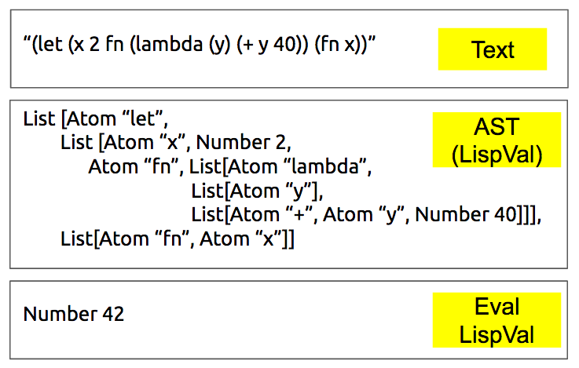

Parsing
------------

## What is Parsing?
**lexeme** the basic lexical unit of meaning.        
**token** structure representing a lexeme that explicitly indicates its categorization for the purpose of parsing.    
**lexer** A algorithm for lexical analysis that separates a stream of text into its component lexemes.  Defines the rules for individual words, or allowed symbols in a programming language.     
**parser** an algorithm for converting the lexemes into valid language grammar. Operates on the level above the lexer, and defines the grammatical rules.
    
Most basically, Parsing and Lexing is the process of converting the input text of either the REPL or script and converting that into a format that can be evaluated by the interpreter. That coverted format, in our case, is `LispVal`. The library we will use for parsing is called `Parsec`.

## About Parsec
Parsec is a monadic parser, and works by matching streaming text to lexeme then parsing that into an abstract syntax via data constructors. Thus, for text input, the lexemes, or units of text that define a language feature, are converted a `LispVal` structure. These lexemes are individually defined via Parsec, and wholly define the valid lexical structure of our Scheme.

## Why Parsec?
Parsec is preferable for its simplicity compared to the alternatives: Alex & Happy or Attoparsec. Alex & Happy are more complex, and require a separate compilation step. Parsec works well for most grammars, but is computationally expensive for left recursive grammars. Attoparsec is faster, and preferable for parsing network messages or other binary formats. Parsec has better error messages, a helpful feature for programming languages. If our language required a lot of left-recursive parsing, Alex & Happy would probably be a better choice. However, the simplicity and minimalism of Scheme syntax makes parsing relatively simple.


## How parsing will work
The parser will consume text, and return a `LispVal` that can be evaluated. Parsec defines parsers using,    
```Haskell
newtype Parser LispVal = Parser (Text -> [(LispVal,Text)])
```    
Thus, a Parser is a type consisting of a function that 1) takes some `Text` and 2) return a `LispVal` and some `Text`


## Parser.hs imports
```Haskell
import LispVal
import Text.Parsec
import Text.Parsec.Text
import Text.Parsec.Expr
import qualified Text.Parsec.Token as Tok
import qualified Text.Parsec.Language as Lang
import qualified Data.Text as T
import Control.Applicative hiding ((<|>))
import Data.Functor.Identity (Identity)
```
Good for us, Parsec is available with `Text`, not just `String`. If you are looking online for examples of Parsec, make sure you have the correct encoding of strings. Converting can be a little bit of a hassle, but its worth the extra effort. If you are really serious about your language project, I suggest using Alex & Happy. I've used them happily used them in production to parse a javascipt-esque language! 


## Tokenizer
```Haskell
style
lexer
Tok.TokenParser
```


## Lexer
```Haskell 
lexer :: Tok.GenTokenParser T.Text () Identity
lexer = Tok.makeTokenParser style

style :: Tok.GenLanguageDef T.Text () Identity
style = Lang.emptyDef {
  Tok.commentStart = "{-"
  , Tok.commentEnd = "-}"
  , Tok.commentLine = "--"
  , Tok.opStart = Tok.opLetter style
  , Tok.opLetter = oneOf ":!#$%%&*+./<=>?@\\^|-~"
  , Tok.identStart = letter <|>  oneOf "-+/*=|&><"
  , Tok.identLetter = letter <|> oneOf "?+=|&-/"
  , Tok.reservedOpNames = [ "'", "\""]
  }
```
Whelp, that's about all we need. Parsec does the heavy lifting for us, all we need to do is supply the specification for the lexeme. Starting with comments, we'll use the same standards as Haskell, and moving on to operators and identifiers. Finally, we established reserved operators, which will be single and double quotes. Almost feels like cheating! 
```Haskell
-- pattern binding using record destructing !
Tok.TokenParser { Tok.parens = m_parens
           , Tok.identifier = m_identifier } = Tok.makeTokenParser style
```
Before we move on, I'm going to define some shortcuts via pattern binding using record decunstruction. It's a neat trick.

## Parser!

```Haskell
reservedOp :: T.Text -> Parser ()
reservedOp op = Tok.reservedOp lexer $ T.unpack op
```
Using our shortcut, we can define a quick helper function with the lexer to match reserved ops.    
Now, given the diagram, we must move from `Text` to `LispVal`. Parsec will be handling the lexing, which leaves the formation of `LispVal` to us. You will notice the use of `T.pack`, which is `T.pack :: String -> Text`. For each type of `LispVal`, we will have a seperate function to parse that form. 

```Haskell
parseAtom :: Parser LispVal
parseAtom = do 
  p <- m_identifier
  return $ Atom $ T.pack p

parseText :: Parser LispVal
parseText = do 
  reservedOp "\""
  p <- many1 $ noneOf "\""
  reservedOp "\""
  return $ String . T.pack $  p

parseNumber :: Parser LispVal
parseNumber = Number . read <$> many1 digit

parseList :: Parser LispVal
parseList = List . concat <$> Text.Parsec.many parseExpr `sepBy` (char ' ' <|> char '\n')

parseSExp = List . concat <$> m_parens (Text.Parsec.many parseExpr `sepBy` (char ' ' <|> char '\n'))

parseQuote :: Parser LispVal
parseQuote = do
  reservedOp "\'"
  x <- parseExpr
  return $ List [Atom "quote", x]


parseReserved :: Parser LispVal
parseReserved = do
  reservedOp "Nil" >> return Nil
  <|> (reservedOp "#t" >> return (Bool True))
  <|> (reservedOp "#f" >> return (Bool False))
```
Phew! That wasn't so bad! Monadic parsing makes things somewhat managable, we consume a little bit of text, grab what we need with monadic binding, maybe consume some more text, then return our `LispVal` data constructor with the bound value. There is one extra parser, `parseList`, which will be used to parse programs, since programs can be a list of newline delimitted S-expressions.  Now that we can parse each of the individual `LispVals`, how would we parse an entire S-Expression? 

```Haskell 

parseExpr :: Parser LispVal
parseExpr = parseReserved
  <|> parseAtom
  <|> parseText
  <|> parseQuote
  <|> parseSExp
```
Of course! `<|>` is a combinator that will go with the first parser that can successfully parse into a `LispVal`. If you are writing this parser, or don't like mine and decide to write your own (do it!), this part will require some thought. Here be dragons, and if your syntax is very complex, use Alex & Happy.     

## [Understanding Check]
You just moved to Paris, France and can't find the quote on a local keyboard. Change the quote to a "less than" symbol in the parser. Where do all the changes need to be made?    
Move around the ordering in `parseExpr`, what happens?    
parseNumber works for positive numbers, can you get it to work for negative numbers?    
Parsec `Parser` is used as both a monad and a functor, give an example of both.     


## Putting it all together
Parsec needs to play nice with the rest of the project, so we need a way to run the parser on either text from the repl or a program file and return`LispVal` or `ParseError`. 
```Haskell
contents :: Parser a -> Parser a
contents p = do
  Tok.whiteSpace lexer
  r <- p
  eof
  return r

readExpr :: T.Text -> Either ParseError LispVal
readExpr = parse (contents parseExpr) "<stdin>"

readExprFile :: T.Text -> Either ParseError LispVal
readExprFile = parse (contents parseList) "<file>"
```
`contents` is a wrapper for a Parser that allow leading whitespace and a terminal eof. For `readExpr` and `readExprFile` we are using Parsec's `parse` function, which takes a parser, and a `Text` input describing the input source. `readExpr` is used for the REPL, and `readExprFile`, which uses our `parseList` and can handle newline or whitespace delimmited S-Expressions, for program files. 


#### Conclusion
Top down, we have gone from text input, to tokens, to `LispVal`. Now that we have `LispVal`, we need to get to `Eval LispVal`. It's time to start running programs, let's take it to eval!        


#### Next, Evaluation
[home](00_overview.md)...[back](01_introduction.md)...[next](03_evaluation.md)


#### Additional Reading 
https://github.com/bobatkey/parser-combinators-intro    
http://unbui.lt/#!/post/haskell-parsec-basics    
http://dev.stephendiehl.com/hask/#parsing    
http://stackoverflow.com/questions/19208231/attoparsec-or-parsec-in-haskell/19213247#19213247
