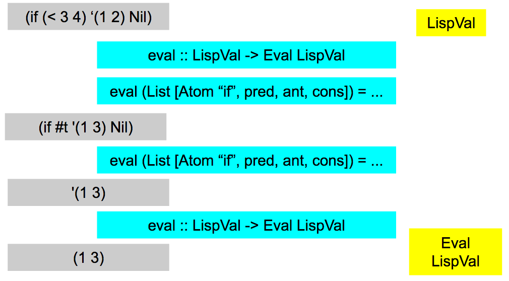

## Evaluation
------------
> True genius resides in the capacity for evaluation of uncertain, hazardous, and conflicting information. **Winston Churchill**    


#### Evaluation Context

LispVal.hs defines our key data structure for evaluation:   


## Eval Monad

```haskell
newtype Eval a = Eval { unEval :: ReaderT EnvCtx IO a }
  deriving (Monad, Functor, Applicative, MonadReader EnvCtx, MonadIO)

```

This code will be the form used to control evaluation.  Specifically, it allows for lexical scoping, user input, and will contain the return `LispVal` for any valid expression.  If your asking yourself how such a complex data structure is possible, then welcome to the world of monad transformers.  These wonderful abstractions allow programmers to combine monads and automatically generate the correctly lifted functions.  For instance, our `Eval`'s `IO` would need its functions to be lifted, but since we derived `MonadIO`, this automatically happens for us.     
This 'magic' is made possible through `{-# LANGUAGE GeneralizedNewtypeDeriving #-}` pragma.  The big addition we get here is `liftIO`, which lets us operate `IO` actions within `Eval` context: `liftIO :: IO a -> m a`.  We will not be discussing this further, but its really a powerful technique that enables wonderfully powerful yet succinct abstractions to serve at the heart of our Lisp!    

## Running The Eval Monad
Getting the `EnvCtx`    

```haskell
basicEnv :: Map.Map T.Text LispVal
basicEnv = Map.fromList $ primEnv
          <> [("read" , Fun $ IFunc $ unop $ readFn)]
```

This is our primitive environment, which will be detailed in the next chapter on [Prim.hs](../src/Prim.hs). Recall that we defined `EnvCtx` in [LispVal.hs](../src/LispVal.hs) as:

```haskell
type EnvCtx = Map.Map T.Text LispVal
```
Our environment is a collection of bindings between names and entities referenced by the names.  For now, we must only concern ourselves with the fact that the names in the environment comes from `LispVal's` `Atom` data constructor.  This data structure is going to be the basis of our lexical scoped variable look up.    
```haskell
evalFile :: T.Text -> IO () --program file
evalFile fileExpr = (runASTinEnv basicEnv $ fileToEvalForm fileExpr) >>= print

fileToEvalForm :: T.Text -> Eval LispVal
fileToEvalForm input = either (throw . PError . show )  evalBody $ readExprFile input

runParseTest :: T.Text -> T.Text -- for view AST
runParseTest input = either (T.pack . show) (T.pack . show) $ readExpr input

runASTinEnv :: EnvCtx -> Eval b -> IO b
runASTinEnv code action = runResourceT $  runReaderT (unEval action) code

```

From [Parser.hs](../src/Parser.hs) we have

```haskell
readExprFile :: T.Text -> Either ParseError LispVal
readExprFile = parse (contents parseList) "<file>"
```
There is a lot of movement here (possibly dragons), and the functions above do the following things:    
* `evalFile` is used from the `main :: IO ()` loop to run a program file.    
* `readExprFile` runs the parser on the program text to return a `LispVal` or `ParseError`.    
* `fileToEvalForm` runs the parser, if an error occurs, it converts it into a `LispException`, `PError` and throws it, else, it evaluates it using `evalBody`.     
* `runASTinEnv` executes the the `evalBody :: LispVal -> Eval Body` with the `EnvCtx`, essentially running our program by first unwrapping `Eval` with `unEval` (the data accessor to `Eval`), then using the `runReaderT` and `runResourceT` functions on the transformed monad.

## eval function: rationale     
Using our aptly named `Eval` structure, we will define the `eval` function within [Eval.hs]](../src/Eval.hs) as follows:

```haskell
eval :: LispVal -> Eval LispVal
```

Given our type signature, we can think back to our Scheme semantics, and recall we need to handle a few special cases:       

* **LispVal**    For primitive types, like Number or String, these values will evaluate to themselves.  This is known as the autoquote facility of Lisp.    
* **begin**    The begin function takes a series (one or more) S-Expressions, starting with 0 or more `define` statements, and evaluates each form in order.  The argument to `begin` will be known ad a "body" or "body-expression".    
* **define**    Binds an evaluated `LispVal` to an `Atom`.    
* **write**    Takes its argument, un-evaluated, and returns a `String` whose value is the result of running `showVal`.    
* **if**    Evaluates its first form, if true, evaluates second, else, evaluates the third.  The same as every other language!    
* **let**    Let takes a list of alternating atoms and S-Expressions and an S-Expression, which is a body expression.  The first argument of alternating values and S-Expressions is bound to a local environment which the body is evaluated in. No order of evaluation on the first argument can be assumed, thus variables to be bound cannot appear in the S-Expression bound to another variable.    
* **lambda**    This is how we will create anonymous functions.  Thinking back to our `LispVal`, recall the data constructor, `Lambda IFunc EnvCtx` where essentially `IFunc :: LispVal -> Eval LispVal`. Two arguments are accepted, a list of atomic values to serves as the function parameters, and a body-expression, which can be evaluated in an environment with the incoming arguments bound to the parameters from the first argument.  The `EnvCtx`, and thus lexical scope, can be stored be getting the local environment via the `reader` monad function, `ask`.  Lambda is really powerful, so incredibly powerful, that we could use it with `Atom` to implement everything else. It's a neat idea called [Lambda Calculus](http://dev.stephendiehl.com/fun/lambda_calculus.html)!         

These will be known as our "Special Forms", different from functions defined in the primitive environment or standard library, as they are implemented via pattern matching on the argument (`LispVal`) of the `eval` function.  All other functions will either be primitives or from the standard library, and have their argument evaluated before being passed into the function.  Therefore, special forms will require non-standard evaluation of their arguments, sometimes having arguments not evaluated, or evaluated under special conditions.  This difference is what determines what must be implemented as an `eval` pattern match, and what can be done elsewhere.            

## Eval Function: implementation
```Haskell
eval :: LispVal -> Eval LispVal
```
The eval function is the heart of our interpreter, and must be able to pattern match every possible valid syntax, as well as the special forms.  This is a pretty tall order, so we are going to approach this by going through the eval function piece by piece along with the helper functions needed to run that code.  It's a little disjoint, but the simplest way to explain exactly how we are going to implement the syntax and semantics of Scheme in Haskell.  As always, to see it all together, see [Eval.hs](../src/Eval.hs). As we go through the code you will see some `throw`, which are covered in the next chapter, for now, recognize that `throw $ LispExceptionConstructor "message-1"` returns `Eval LispVal`.          


#### quote     
```Haskell
eval (List [Atom "quote", val]) = return val
```
Quote return un-evaluated value, pretty basic, but it helps to start out simple, and grow more complex!         

#### autoquote      
```Haskell
eval (Number i) = return $ Number i
eval (String s) = return $ String s
eval (Bool b)   = return $ Bool b
eval (List [])  = return Nil
eval Nil        = return Nil
```
For Number, String, Bool, and Nil, when we evaluate, we simply return the value.  This is known as the autoquote facility, and makes it so we can pass these values into functions an evaluate them without consequence, or logic deferring evaluation of these types.  For `List`, we have made the evaluation of an empty list go to `Nil`. This will be useful for functions that consume the input of a list conditional on the list having items left.    


autoquote returns self for Number, Bool, String, Nil. () => Nil,
#### write     
```Haskell
eval (List [Atom "write", rest])      = return . String . T.pack $ show rest
eval (List ((:) (Atom "write") rest)) = return . String . T.pack . show $ List rest
```
Write does not evaluate argument or arguments, and instead runs `show` on them before return that value in a `String`.  For the second version, we are taking the two or more arguments passed to write and simply converting them into a `List`.

#### Atom
```Haskell
eval n@(Atom _) = getVar n

getVar :: LispVal ->  Eval LispVal
getVar (Atom atom) = do
  env <- ask
  case Map.lookup atom env of
      Just x  -> return x
      Nothing -> throw $ UnboundVar atom
```
Now we're talking! When we evaluate an Atom, we are essentially doing variable lookup.  `getVar` will do this lookup by getting the `EnvCtx` via ask, then running a `Map` lookup, returning the value if found, else throwing an error.  

#### if    
```Haskell
eval (List [Atom "if", pred, truExpr, flsExpr]) = do
  ifRes <- eval pred
  case ifRes of
      (Bool True)  -> eval truExpr
      (Bool False) -> eval flsExpr
      _            -> throw $ BadSpecialForm "if"
```
Here we implement the familiar `if` special form. First, we evaluate the predicate by recursing on the `eval` function.  Given that value, we pass it to a case statement, for True, we evaluate the third S-Expression, and for false, the fourth.  Thus, `if` only evaluates one of its third or fourth arguments, requiring it to be a special form.

#### let
```Haskell
eval (List [Atom "let", List pairs, expr]) = do
  env   <- ask
  atoms <- mapM ensureAtom $ getEven pairs
  vals  <- mapM eval       $ getOdd  pairs
  let env' = Map.fromList (Prelude.zipWith (\a b -> (extractVar a, b)) atoms vals) <> env
  in local (const env')  $ evalBody expr

getEven :: [t] -> [t]
getEven [] = []
getEven (x:xs) = x : getOdd xs

getOdd :: [t] -> [t]
getOdd [] = []
getOdd (x:xs) = getEven xs

ensureAtom :: LispVal -> Eval LispVal
ensureAtom n@(Atom _) = return  n
ensureAtom n = throw $ TypeMismatch "atom" n

extractVar :: LispVal -> T.Text
extractVar (Atom atom) = atom
```
The `let` special form takes two args, a list of pairs and an expression.  The list of pairs consists of an atom in the odd place, and an S-Expression in the even place.  For instance, `(let (x 1 y 2)(+ x y))` . From the current environment, a new environment is created with these bindings added, and the expression is evaluation as a body-expression in that environment.         


#### begin, define & evalBody
```Haskell
eval (List [Atom "begin", rest]) = evalBody rest
eval (List ((:) (Atom "begin") rest )) = evalBody $ List rest

eval (List [Atom "define", varExpr, expr]) = do
  varAtom <- ensureAtom varExpr
  evalVal <- eval expr
  env     <- ask
  let envFn = const $ Map.insert (extractVar varAtom) evalVal env
  in local envFn $ return varExpr

evalBody :: LispVal -> Eval LispVal
evalBody (List [List ((:) (Atom "define") [Atom var, defExpr]), rest]) = do
  evalVal <- eval defExpr
  env     <- ask
  local (const $ Map.insert var evalVal env) $ eval rest
evalBody (List ((:) (List ((:) (Atom "define") [Atom var, defExpr])) rest)) = do
  evalVal <- eval defExpr
  env     <- ask
  let envFn = const $ Map.insert var evalVal env
  in local envFn $ evalBody $ List rest
evalBody x = eval x
```
The begin special form is designed to accept two types of inputs: one for each of the pattern matched `evals`.  In the first form, `eval` matches on `List[Atom "begin", rest]`, where rest is then passed to `evalBody`.  The second form, or expanded form, accepts `List ((:) (Atom "begin") rest)`, where rest is type `[LispVal]`. `rest` is then moved into a `LispVal` via the `List` data constructor, and then passed onto `evalBody`.  This allows us to either accept the arguments as a single list, or as individual arguments.  Further, this prevents us from wrapping an extra `List` around single values, since we make sure there are at least two or more values in `rest` when we pass it to `List`, before subsequently passing to `evalBody`.  There is one more pattern match, for define, but its real worth will only emerge after discussing `evalBody`.     
`evalBody`  allows us to use the `define` statement, and evaluate body-expressions.  These body expressions are not only important to `lambda` and `let`, but absolutely essentially to the creation of a standard library, where many defines are used to bind library functions to the environment.  `evalBody` pattern matches on a list composed of either (a define expression, and one other expressions) or (a define expression, and two or more other expressions). For the first case, we bind the `define` forms variable and value to the environment, then run the second expression in this modified environment using `eval`.  In the case the the second expression is also a `define` special form, we a pattern match for `eval` that handles `define`. This will come up when loading in our standard library consisting of only `define` values.  For the second pattern match on `evalBody`, we do the binding to the environment for the define, then recurse on `evalBody` for the rest of the arguments in the modified environment.  The last S-Expression of the `evalBody` `List` will be passed to `eval`, and the result will be evaluated in an environment created by sequentially applying the defines, and the return value of `evalBody` will be the return value of the evaluated S-Expression.    

#### lambda & applyLambda
```Haskell
eval (List [Atom "lambda", List params, expr]) = do
  envLocal <- ask
  return  $ Lambda (IFunc $ applyLambda expr params) envLocal
eval (List (Atom "lambda":_) ) = throw $ BadSpecialForm "lambda"

applyLambda :: LispVal -> [LispVal] -> [LispVal] -> Eval LispVal
applyLambda expr params args = do
  env <- ask
  argEval <- mapM eval args
  let env' = Map.fromList (Prelude.zipWith (\a b -> (extractVar a,b)) params argEval) <> env
  in local (const env' ) $ eval expr

-- From LispVal.hs
data IFunc = IFunc { fn :: [LispVal] -> Eval LispVal }

```
get env, return function w/ applylambda that takes expr and params
to evaluate lambda, see applyLambda:
  eval input args in calling env, create new environment with input args bound, eval expr w/ new Environment

The lambda special form gives our users the ability to create and define functions.  Variables within those functions, will be lexically scoped, which means they will always have the value they had when they were enclosed within the lambda.  We will achieve lexically scoped variables by bringing a copy of the `EnvCtx` with us into the `Lambda` data constructor, `Lambda IFunc EnvCtx`.  When we encounter the lambda special form in eval, we grab the environment, then return the data constructor for `Lambda` along an `IFunc $ applyLambda expr params` and the grabbed environment.  Looking at `applyLambda`, what we are doing is partially applying the parameters of a function, to return a function that accepts arguments `[LispVal]`, binds them to the atomic values in the parameters, then evaluates the expression passed into `applyLambda` as `expr`.  Thus, we go from `applyLambda :: LispVal -> [LispVal] -> [LispVal] -> Eval LispVal` to `applyLambda expr params :: [LispVal] -> Eval LispVal` which is the correct type for the type `IFunc`.  Thus, we can achieve lexical scoping using the `Reader` monad.    


#### application
```Haskell
eval (List ((:) x xs)) = do
  funVar <- eval x
  xVal   <- mapM eval  xs
  case funVar of
      (Fun (IFunc internalFn)) -> internalFn xVal
      (Lambda (IFunc internalfn) boundenv) -> local (const boundenv) $ internalfn xVal
      _                -> throw $ NotFunction funVar
```
The final form is application, we've made it!  If you are familiar with lambda calculus, this is one of the three forms, along with variables and lambdas.  The way we perform application is to pattern match on the head, then tail of `List`.  Next, we evaluate both of these values.  We run `case` on `funVar`, which should be either a `Fun` (internal function), or `Lambda`, a user-defined or library function.  If internal, we simply extract the function of type `[LispVal] -> Eval LispVal` and apply the arguments.  For `Lambda`, we must evaluate the function within the environment provided by the `Lambda` to ensure lexical scope is maintained.  
* note // is Lambda defining the lexical scope twice? Once in the partial funciton and once via the EnvCtx ??


## Conclusion
That was a lot! If `LispVal` defines the syntax, then `Eval` defines the semantics.  Now is a good time to read [Eval.hs](../src/Eval.hs) and see it work all together, since that's all that defines the mechanism of evaluation.  Our implementation is made possible by monad transformers, specifically the integration of `ReaderT`, which we use to implement lexical scope.  Without monads, we would have to pass in an extra argument to every `eval`, as well as some of the helper functions, not to mention the complication of handling the other functionality of monads composed within our `Eval`.  For a simple interpreter, its hard to do much better.  For a faster interpreter, we would need to compile.      
Anyway, we have the the basis for our language and could start work on proving theoretical properties.  We won't do this, and instead move towards gaining the next thing needed to be practical, a collection of basic operations to manipulate data.  But before moving on to primitives, we quickly cover errors, which show up all over `eval` function.  If you just can't wait to define some functions and get the REPL up and running, the basic message is, when bad things happen, throw an error that gives the user enough information to fix the problem.        

## [Understanding Check]
Implement a delay function as a special form that returns its argument as the body of a lambda expression that accepts no arguments. `(delay x) => (lambda () x)`    
You careful read the R5RS standard and are upset to realize we have implemented `let` incorrectly. Instead of `(let (x 1 y 2) (+ x y))` the standard calls for `(let ((x 1) (y 2)) (+ x y))`. Make this change.    
GADTs are sometimes used to implement `LispVal`. How would evaluation change?        
Implement one of (`case`, `letrec`, `let*`, `sequence`, `do`, `loop`) as a special form.  Check the [R5RS](../docs/R5RS.pdf) standard for more information.    
[Bonus] Find a unique difference in the implementation of special forms between this project and R5RS, implement the special form, then submit a new PR.        

#### Additional Resources:

* http://catamorph.de/documents/Transformers.pdf    
* https://github.com/justinethier/husk-scheme/tree/master/hs-src/Language/Scheme  

#### Danger Will Robinson, on to Errors!
[home](00_overview.md)...[back](03_evaluation.md)...[next](04_errors.md)
